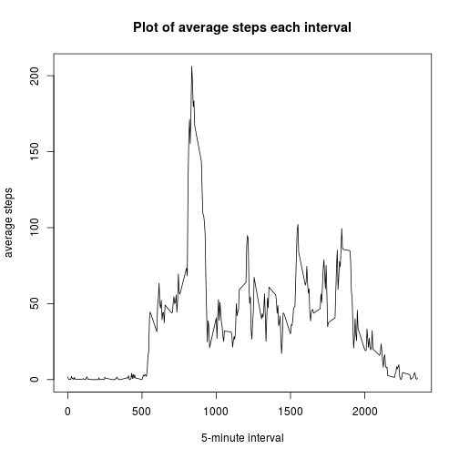
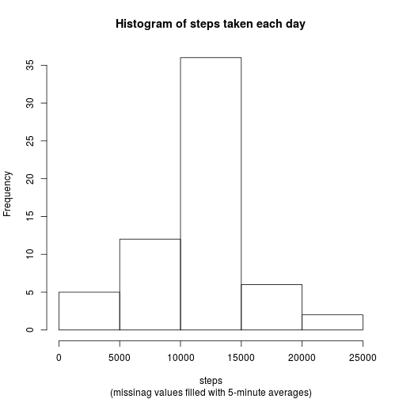
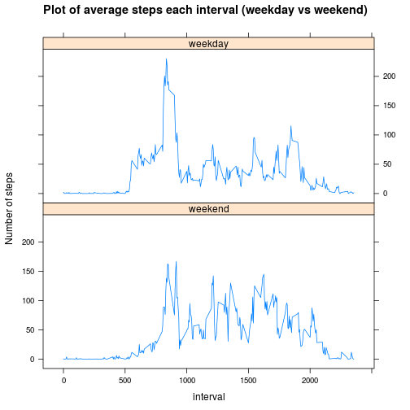

```r
# Set the global options
opts_chunk$set(echo = TRUE, cache = TRUE)
```

## Loading and preprocessing the data

The data is from a personal activity monitoring device. This device collects data at 5 minute intervals through out the day. The data consists of two months of data from an anonymous individual collected during the months of October and November, 2012 and include the number of steps taken in 5 minute intervals each day.

There are a total of 17,568 observations in the dataset. The variables included in the dataset are:

* **steps**: Number of steps taking in a 5-minute interval (missing values are coded as NA)
* **date**: The date on which the measurement was taken in YYYY-MM-DD format
* **interval**: Identifier for the 5-minute interval in which measurement was taken

The data structure is rather simple, so it's not necessary to do any preprocessing or transformation.


```r
setwd('~/repo/RepData_PeerAssessment1')
# It's strange that you can't use open = 'r' to unz, otherwise you'll get a 
# seek not enabled error with read.csv. 
con <- unz('activity.zip', 'activity.csv')
# The con will be destroyed at the end of the function call to read.csv, so 
# it's not necessary to close it explicitly.
df <- read.csv(con, na.strings = 'NA', stringsAsFactors = FALSE)
```

## What is mean total number of steps taken per day?

The dataset consists the data of 2 months, i.e., 61 days. After calculating the total number of steps taken per day, and making a histogram of them, the distribution of the daily steps is clear to see. 


```r
library(dplyr)
```

```
## 
## Attaching package: 'dplyr'
## 
## The following objects are masked from 'package:stats':
## 
##     filter, lag
## 
## The following objects are masked from 'package:base':
## 
##     intersect, setdiff, setequal, union
```

```r
df2 <- df %>% 
    group_by(date) %>% 
    summarise(day_total = sum(steps, na.rm = TRUE))
with(df2, hist(day_total, main = 'Histogram of steps taken each day', 
                          xlab = 'steps'))
```

 

```r
day_mean <- mean(df2$day_total)
day_median <- median(df2$day_total)
```

The mean and median of the total number of steps taken per day are 9354 and 10395 respectively. 

## What is the average daily activity pattern?

The time series plot of the 5-minute interval and the average number of steps taken (averaged across all days) reveals the following facts:

* At night, the activity level is rather low.
* During the day, the number of steps taken each 5-minute interval goes up and down, with a peak between 8:35 to 8:40 (this interval contains the maximum number of steps about 206). Maybe the individual is walking to work then, or is doing some morning exercises.


```r
df3 <- df %>% 
    group_by(interval) %>% 
    summarise(avg_steps = mean(steps, na.rm = TRUE))
with(df3, plot(interval, avg_steps, type = 'l', 
               main = 'Plot of average steps each interval', 
               xlab = '5-minute interval', ylab = 'average steps'))
```

 

```r
max_steps <- df3 %>% filter(avg_steps == max(avg_steps))
```

## Imputing missing values

Note that there are a number of days/intervals where there are missing values (coded as NA). The presence of missing days may introduce bias into some calculations or summaries of the data.


```r
na_num <- sum(!complete.cases(df))
```

The total number of missing values in the dataset (i.e. the total number of rows with NAs) is 2304. I prefer to using the mean for the specific 5-minute interval to fill in each missing value in the dataset, because people tends to do the same thing at the same time each day. 


```r
df_complete <- df[complete.cases(df), ]
df_incomplete <- df[!complete.cases(df), ]
df_incomplete <- merge(df_incomplete, df3, by = 'interval', all.x = TRUE)
df_incomplete <- df_incomplete %>%
    mutate(steps = avg_steps) %>%
    select(steps, date, interval)
df_filled <- rbind(df_complete, df_incomplete)
df_filled2 <- df_filled %>% 
    group_by(date) %>% 
    summarise(day_total = sum(steps, na.rm = TRUE))
with(df_filled2, hist(day_total, main = 'Histogram of steps taken each day', 
                      sub = '(missinag values filled with 5-minute averages)',
                      xlab = 'steps'))
```

 

```r
day_mean_filled <- mean(df_filled2$day_total)
day_median_filled <- median(df_filled2$day_total)
```

The new histogram of the total numbers taken each day is a little bit different from the original one. The **mean** and **median** go up to 1.0766 &times; 10<sup>4</sup> and 1.0766 &times; 10<sup>4</sup> respectively. (It's really interesting that the new mean and median are exactly the same, maybe it has some bearing on the strategy used to fill in the missing values.) Imputing missing data increased the number of steps taken for the days with NA observations, and the cause is rather intuitive: the original histogram just discarded the NA values, while the new one used some numbers to fill in.

## Are there differences in activity patterns between weekdays and weekends?

Based on the devided dataset of 2 groups: weekend and weekday, the panel plot of the 5-minute interval and the average number of steps taken, averaged across all weekday days or weekend days, suggests that:

* At weekend, the individual get up much later than weekdays - just like me do :)
* During the daytime at weekend, the activity level tends to be at high level all day long, though the range is a little bit smaller. I think that's natural and intuitive.


```r
library(lattice)
# Set LC_TIME to en_US.UTF-8 to ensure the convenience to use Saturday, Sunday
# in the following code chunk
if (Sys.getlocale(category = 'LC_TIME') != 'en_US.UTF-8'){
    Sys.setlocale(category = 'LC_TIME', locale = 'en_US.UTF-8')
}
```

```
## [1] "en_US.UTF-8"
```

```r
df_filled <- df_filled %>% 
    mutate(weekday_grp = weekdays(as.Date(date)) %in% 
                                  c('Saturday', 'Sunday')) %>%
    mutate(weekday_grp = factor(weekday_grp, levels = c(TRUE, FALSE),
           labels = c('weekend', 'weekday'))) %>% 
    group_by(weekday_grp, interval) %>% 
    summarise(avg_steps = mean(steps, na.rm = TRUE))

with(df_filled, xyplot(avg_steps ~ interval | weekday_grp, type = 'l', 
                       layout = c(1, 2), ylab = 'Number of steps',
                       main = 'Plot of average steps each interval (weekday vs weekend)'))
```

 

(THE END)
